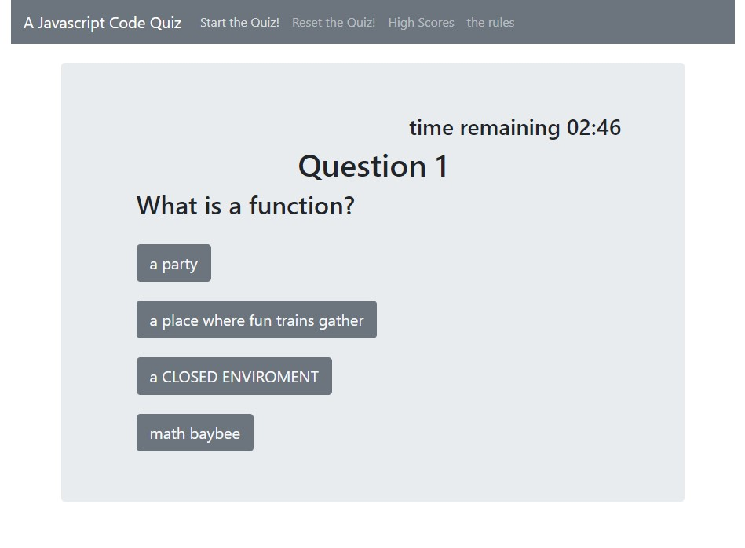

# Code Quiz

Simple Javascript Quiz

10 questions

3:00 minutes 

get a question wrong, you lose 0:20

quiz is over when you run out of time or answer all questions

## Usage

clone repo and open 'index.html' in preferred browser.

-or-

Navigate to https://todayisfineforme.github.io/Code.Quiz/

-then-

click `Start the Quiz!`

answer all questions and input initials to store high score

## Contributing

Pull requests are welcome. For major changes, please open an issue first to discuss what you would like to change.

## License

[MIT](https://choosealicense.com/licenses/mit/)
